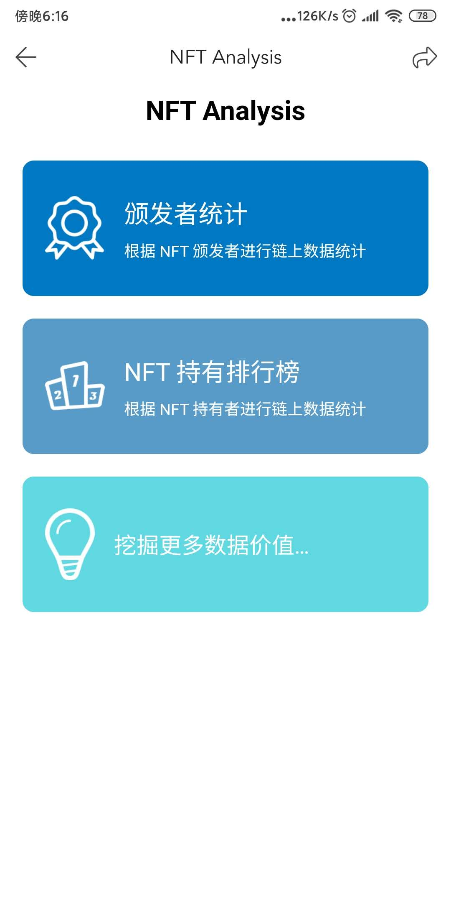
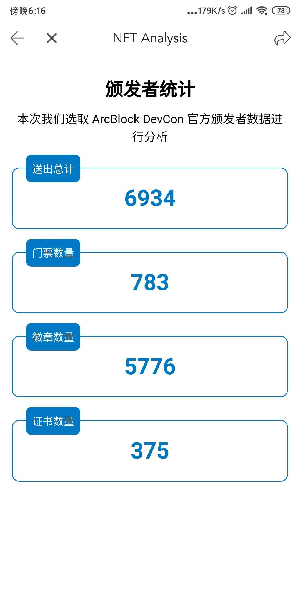
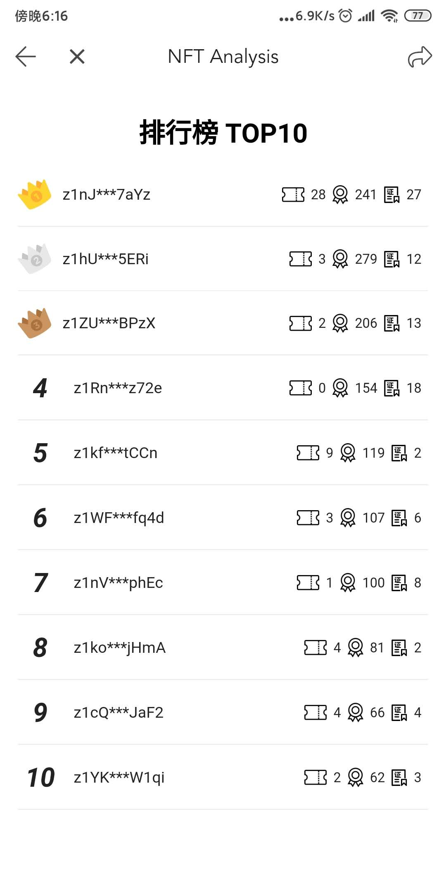

## NFT Analysis

## 一，项目描述

- 对链上的 NFT 数据进行同步 index
- 对链上的 NFT 数据进行多维度的，可定制化的分析
- 定制化的 NFT 展示页面

## 二，项目简介

使用 ArcBlock 提供的 JS SDK 进行代码逻辑编写，主要核心逻辑有：

1. 基于 listTransactions API 对链上创建的 NFT Tx 进行一个全量同步
    1. 首次全量同步之后，后期的同步可以基于参数：timeFilter 实现增量同步
2. 基于 getAssetState API 对已经同步完成的 NFT 进行一个全量的扫描更新，保持本地同步到的 NFT 为链上最新的状态
3. 定期的 listTransitions 增量同步以及 NFT 最新状态的全量同步

本次分析的范围为此次 DevCon 大会期间 ArcBlock DevCon 颁发的 NFT 资产

核心表结构:

- address    NFT 链上地址
- name  NFT 名称
- type  NFT 链上存储的类型
- customType 基于 type 定制的冗余属性
- customCategory  基于 customType 定制的冗余属性
- owner    NFT 所有者
- issuer     NFT 颁发者
- issuerName  NFT 颁发者名称
- transferable   NFT  是否可以交易
- createdAt    NFT 创建时间

## 三，已实现的功能

### 1. 基于某个 Issuer 颁发的 NFT 进行定制化分析统计

### 2. 基于同步数据，对链上 owner 进行一个排名统计以及明细统计

## 四，更多的想法

1. 支持切换不同的链
2. 支持自定义分析的资产类型
